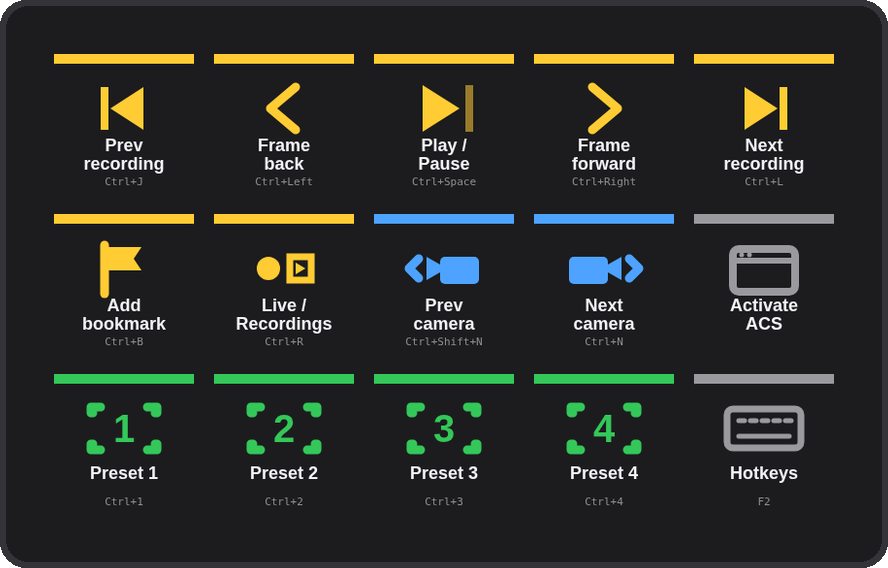
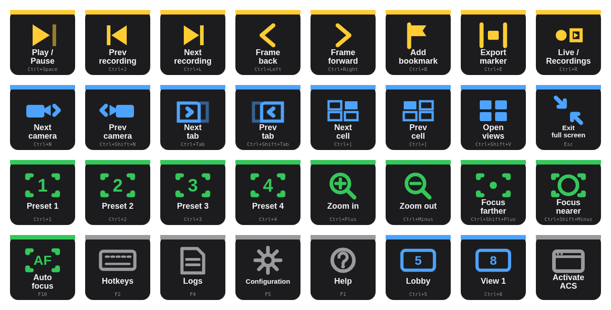
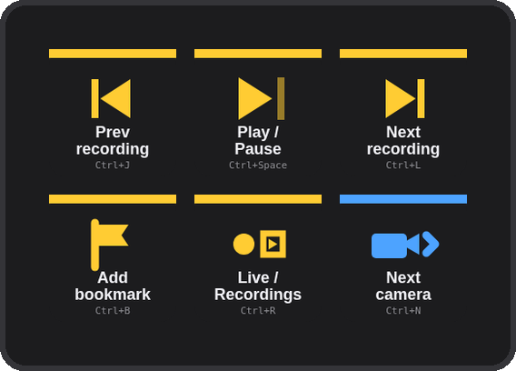
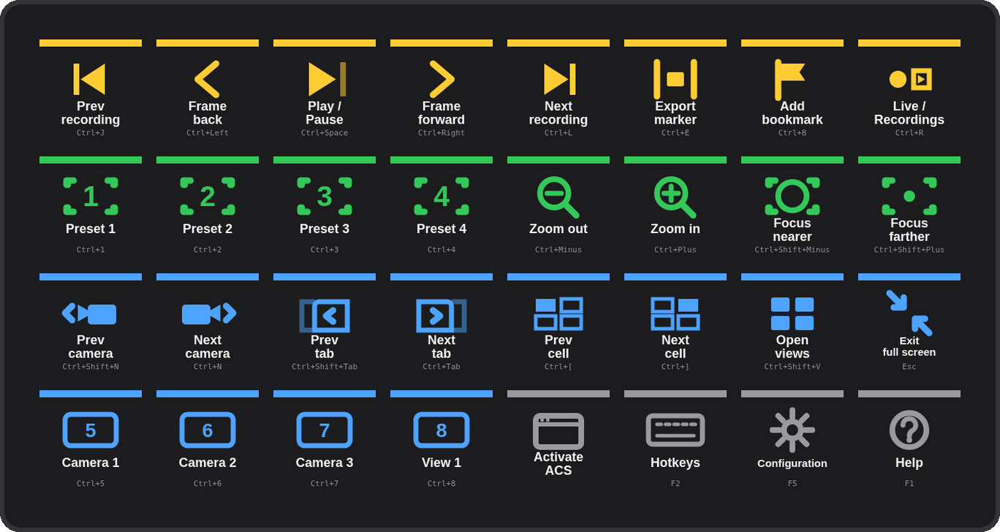

# Deck for AXIS Camera Station Pro & 5

A Stream Deck plugin for the **AXIS Camera Station Pro** and **AXIS Camera Station 5** Windows client — playback, bookmarks, camera navigation, PTZ presets and any hotkey you map in ACS, on physical keys.

**[Website](https://kotyzap.github.io/Stream-Deck-ACS-Pro-Plugin/) · [Download plugin](dist/com.4xsdev.acs-pro.streamDeckPlugin)**



## Install

Download [`com.4xsdev.acs-pro.streamDeckPlugin`](dist/com.4xsdev.acs-pro.streamDeckPlugin) (or install from the Elgato Marketplace) and double-click it. Stream Deck adds the **Deck for AXIS Camera Station Pro & 5** action group and a ready-made profile for your device — **ACS Pro** (15 keys), **ACS Pro Mini** (3×2) or **ACS Pro XL** (8×4).

Requirements: Windows 10+, Stream Deck software 6.9+, the AXIS Camera Station Pro or AXIS Camera Station 5 client.

## How ACS hotkeys work — read this first

ACS is driven by **keyboard hotkeys** that you view and edit in the client under **F2 → Hotkeys**. A keyboard hotkey is <kbd>Ctrl</kbd> + a key, or <kbd>F2</kbd>–<kbd>F12</kbd>, and every action can be re-mapped. Axis documents only a handful of defaults (zoom <kbd>Ctrl</kbd> <kbd>+</kbd>/<kbd>−</kbd>, help <kbd>F1</kbd>, hotkeys <kbd>F2</kbd>, logs <kbd>F4</kbd>, configuration <kbd>F5</kbd>, auto focus <kbd>F10</kbd>, exit full screen <kbd>Esc</kbd>); the "Navigate to camera / view" actions have **no** default at all.

So the plugin works like this:

- Every **ACS Command** key sends a combo. For documented actions it is Axis's combo (marked ✓ in the key's settings). For the rest it is a **suggestion** (e.g. Play/Pause = <kbd>Ctrl</kbd> <kbd>Space</kbd>) — open F2 in ACS once, click the action's keyboard field, press the same combo. Or type into the key's **Hotkey** field whatever your ACS already uses.
- The **ACS Hotkey** key is free-form: title + combo. Map <kbd>Ctrl</kbd> <kbd>5</kbd> to "Navigate to camera: Lobby" in ACS, make a key "Lobby → Ctrl+5", and an XL becomes a camera wall selector.
- Every key shows the combo it sends in small print, so you can always see what will happen.

## Actions



| Action | What it does |
|---|---|
| **ACS Command** | One of 29 ACS actions in four groups — Recordings (play/pause, previous/next recording, frame step, bookmark, export marker, live/recordings), Navigation (next/previous camera, tab, split-view cell, open views, exit full screen), PTZ (presets 1–4, zoom, focus, auto focus), System (hotkeys, logs, configuration, help). Combo editable per key. |
| **ACS Hotkey** | Any combo with your own title and colour — for cameras, views, sequences and anything else you map in ACS. |
| **Activate ACS** | Brings the ACS client window to the front (matches the window title, default "AXIS Camera Station") so the next hotkey lands in it. |

Combo format: `Ctrl+Shift+F5` — modifiers Ctrl / Alt / Shift; keys A–Z, 0–9, F1–F12, Space, Tab, Esc, Enter, Backspace, Delete, Home, End, PageUp, PageDown, arrows (Up/Down/Left/Right), Plus, Minus.

## Profiles

| Mini | XL |
|---|---|
|  |  |

Generated by `profile/build_profile.py` (`LAYOUTS`); the plugin manifest binds each to its device type. The XL's bottom row carries four **ACS Hotkey** examples (Camera 1–3 = <kbd>Ctrl</kbd> <kbd>5</kbd>–<kbd>7</kbd>, View 1 = <kbd>Ctrl</kbd> <kbd>8</kbd>) to rename.

## How it works

Stream Deck key → plugin (Node.js, Elgato SDK v2) → PowerShell `SendKeys` to the front window; **Activate ACS** uses `WScript.Shell.AppActivate`. No network, no helper app, nothing stored.

## Building

```bash
cd plugin && npm install && npm run build && cd ..     # bundle → plugin/com.4xsdev.acs-pro.sdPlugin/bin/plugin.js
python3 profile/build_profile.py                      # three .streamDeckProfile files
cp profile/*.streamDeckProfile plugin/com.4xsdev.acs-pro.sdPlugin/
node site/render.mjs                                  # key art + icons from the plugin's own SVGs (needs playwright)
python3 site/render_media.py                          # deck mockups, actions sheet, marketplace media (Pillow)
python3 site/build_site.py                            # docs/index.html
npx @elgato/cli validate plugin/com.4xsdev.acs-pro.sdPlugin
npx @elgato/cli pack plugin/com.4xsdev.acs-pro.sdPlugin -o dist
```

## Limits

- Windows only — the ACS Pro / ACS 5 client is a Windows application.
- Hotkeys reach whichever window is in front; the plugin cannot know whether ACS is focused. Use **Activate ACS** first (or chain it in a Multi Action).
- The suggested (non-✓) combos are not ACS defaults — mirror them in F2 → Hotkeys once, or edit the key.
- Written to Axis's documented hotkey rules but **not yet tested on a Windows machine with ACS** — reports welcome via [issues](https://github.com/kotyzap/Stream-Deck-ACS-Pro-Plugin/issues).

## License

MIT — Pavel Kotyza · [4xs.dev](https://www.4xs.dev). Independent project; not affiliated with Axis Communications or Elgato. AXIS is a trademark of Axis AB.
